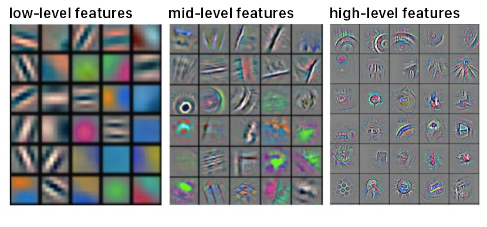
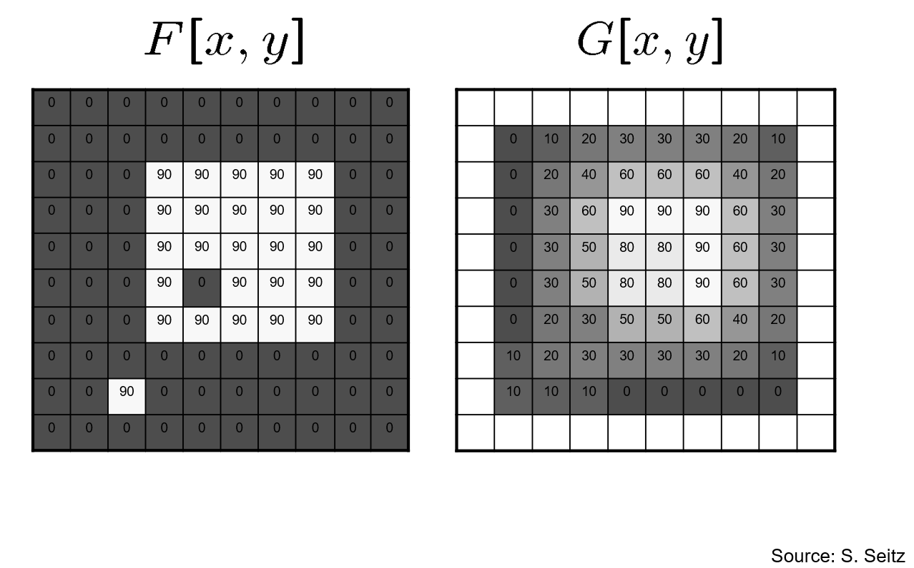

# Convolutional Neural Networks

So far, we've been covering the background for generative models, whether that be fundamental image transformations techniques, or deep learning. Now, we finally venture into real models that are used in generative modeling. We'll start by talking about Convolutional Neural Networks in this set of notes.

Convolutional Neural Networks (also called CNNs or ConvNets) have revolutionized the field of computer vision and image processing. But what makes them so effective compared to regular neural networks? Let's dive into the architecture, components, and key concepts that make CNNs good at working with images.

At their core, CNNs are made up of neurons that have learnable weights and biases, just like normal neural networks. However, CNNs are specifically built to work with images only. This assumption about the input data allows us to include certain special properties into the CNN architecture that optimize them for image processing tasks. 

Let's first look into why traditional neural networks fall short for images. Regular neural networks are limited when working with full-sized images because they often use fully-connected layers. Recall that a fully-connected (FC) layer (also known as a dense layer) is connected to every neuron in the next layer. For image data, FC layers become inefficient and wasteful because the enormous number of parameters inevitably leads to overfitting. Furthermore, FC layers are unable to take advantage of the spatial relationships inherent within image data, which makes it difficult for them to learn useful patterns that can be used for object/feature detection, etc.

## CNN structure
Unlike traditional neural networks, layers in a CNN have neurons arranged in not two but three dimensions: height, width, and depth. This 3D arrangement fundamentally changes how neurons are connected to each other. In a CNN, neurons in one layer connect only to a small region of the previous layer, as opposed to every single neuron (as it is in a FC layer). This is called **sparse connectivity**, and is one of the key innovations that makes CNNs so efficient. Since we have fewer connections, we have fewer parameters to train!

There are three main types of layers used to build CNN architectures. Let's talk about each of them below. 

### Convolutional layers (CONV)
The convolutional layer's parameters consist of a set of filters (kernels) whose weights are learnable. Each filter has two important characteristics: it is smaller than the layer (in width and height). but extends through the full depth of the input volume. 

We convolve these 3D filters in a similar way to how we convolve 2D filters (recall this from a previous set of notes). As we slide and convolve each 3D filter over the input volume, we produce a 2D activation map that captures the responses of that filter at every spatial position. With training, the network learns filters that activate when they detect specific visual features within the image. Early layers typically learn basic features (like edges or color blobs), while deeper layers learn increasingly complex features (like textures, patterns, and eventually object parts). For example, if we are training a CNN to differentiate between images of cats and dogs, the early layers might learn to pick up on edges and textures of fur, while later layers may learn bigger features like ears, faces, etc.

#### Parameter sharing
A key concept to know at this point is parameter sharing, which allows us to dramatically reduce the number of parameters in the network. This approach makes one assumption: if a feature is useful to compute at spatial position $(x, y)$, then it should also be useful at position $(x_2, y_2)$. 

Based on this assumption, we can then constrain all neurons in the same depth slice (the 2D slice of weights at the same depth) to use the same weights and biases. This means:
- The number of unique weight sets equals the depth instead of the total number of neurons
- Forward propagation is also more optimized; since all neurons in a single depth slice are using the same weight vector, then the forward pass within that CONV layer within can be computed as a simple convolution between the neuron's weights and the input volume, making it more efficient. This is also why this layer is called a CONV (Convolutional) Layer.

During backpropagation, we will compute the gradients for every neuron in the volume, but these gradients will be added up across each depth slice and only update a single set of weights per slice.

There are some cases where parameter sharing does not make sense is when we have some specific input images where completely different features should be learned on one side of the image than another → for example, faces where different eye-specific or hair-specific features should be learned in different spatial locations. In this case, we relax the parameter sharing technique and simply call the layer a Locally-Connected Layer; this means that each filter/kernel has separate weights for each spatial location in the input. Unlike a convolutional layer, where the same filter is present throughout the depth slice, in this case the filter changes from position to position.

### Activation layers
CNNs, like regular neural networks, also make use of activation layers. These layers have the same purpose as they did in traditional neural networks, which is to add a non-linear component between layers to allow the network to learn complex relationships. Activation layers are applied after every convolution layer. Some common activation functions are ReLU, Leaky ReLU, Tanh, Sigmoid, Max, etc.

### Pooling Layer
Pooling layers are another type of layer in CNNs that improve efficiency. Pooling layers are typically inserted between successive convolutional layers, their primary primary purpose being to reduce the spatial dimensions of the representation. This reduces the number of parameters, decreases computational requirements, and helps control overfitting. 

A pooling layer resizes each depth slice of the input independently using the MAX operation. Essentially, it goes neighborhood by neighborhood within the 2D depth slice and keeps only the maximum pixel value within that pixel. It thus effectively condenses the information into a smaller, more manageable form.

Note that this type of pooling layer is called a Max Pooling layer. There are other types of layers such as Average Pooling, which keep the average value rather than the max value. Which one you use depends on the context/particular task you are training the CNN for. 

It's worth noting that the use of pooling layers has been decreasing over time, particularly in generative models like VAEs and GANs, where preserving spatial information seems to be more important.

### Fully-Connected layer (FC)
The last layer (output layer) of a CNN is a fully connected layer. It has one neuron per output/class/label. For example, when building a CNN to differentiate between images of dogs, cats, and birds the output layer will be a fully-connected layer with 3 neurons. The outputs of each of those neurons will be sent through a softmax activation in order to output probabilities corresponding to each of the possible outputs.
## Hyperparameters
When designing a CNN, you also need to make decisions regarding hyperparameters. Let's talk about the most important ones below:
#### Filter size (kernel size)
The spatial dimensions of your filters in the Convolutional layers determine the receptive field of each neuron. The receptive field is portion of the input image that a particular neuron is looking at at a time. Some common choices are 3x3, 5x5, etc. but you should choose the size that makes the most sense for your particular application. Smaller filters capture finer details, whereas larger filters are good at capturing more high-level patterns. In modern architectures, we often favor multiple stacked layers of small 3x3 filters as opposed to fewer layers with large filters; this makes training more efficient.
#### Number of filters (aka filter depth)
Filter depth determines how many different feature detectors you'll have at each layer. Early layers might have 32 or 64 filters to detect basic features, while deeper layers often have hundreds or even thousands of filters to capture more complex patterns. Increasing the number of filters increases the model's capacity but requires more computation and memory.
#### Stride
Stride controls how many pixels the filter skips as it moves across the input volume. When we last talked about convolutions and correlation filtering, we assumed a stride of 1, meaning that we don't skip any pixels when we move the filter across the image. If we instead use a bigger stride, such as 2, or 3, we will skip 1 or 2 pixels (respectively) when moving the filter to the next neighborhood. The motivation for using a larger stride is to reduce the spatial dimensions of the output volume (this can serve as an alternative to pooling layers). However, in cases where you want to preserve spatial information, it is recommended to just use a stride of 1. Keep in mind that while using a larger stride might make your model train faster, it will also lose information along the way.

#### Padding
Padding adds extra pixels around the input volume border, allowing you to control the output volume's spatial dimensions. As you start implementing neural networks in Pytorch or TensorFlow, you'll notice that there are several different types of padding. 
- "Valid" padding means no padding. It means that your output will likely be missing the outer edges and will have a smaller spatial dimension after each convolution. You can try working this out for yourself. Imagine convolving a small 3x3 filter across an image. What happens to the edges of that image? They get cut out since we don't have their full neighborhood to convolve with. 

Above is an example of no padding. Notice how the edges of the original image $F$ have been cut out in the filtered image $G$. If we instead include "dummy pixels" around the edge of $F$ (padding), then we do not lose information about $F$ during the filtering operation!

- "Same" padding ensures that the output spatial dimensions are the same as the input by adding zeros around the border of the input..
- "Full" Padding adds enough padding so that every pixel in the input gets used as the center of a convolution operation at least once. This results in larger output dimensions.
There are also different types of padding pixels:
- Zero padding: the padding pixels have a value of 0 (this is most common)
- Reflect padding: the padding pixels are a mirror reflection of the border pixels
- Replicate padding: the padding pixels replicate the closes edge pixel
- Circular padding (wrap around): the input is treated as if it were a continuous loop, with the last pixel wrapping around to the beginning.
Each of these has their own advantages and disadvantages. For example, in image detection or learning tasks, zero padding may not be the best option since it introduces black borders around each image, which might distort learning for models sensitive to edge information. In that case, a different type of padding might work better. It is important to try different methods out and see which one works best for your particular implementation.
#### Other hyperparameters
There are many other hyperparameters in CNNs, even within the layers themselves. The hyperparameters we just covered are most relevant to the CONV layers. For pooling layers, we also have the following hyperparameters:
- pooling type
- pool size
- pooling stride
For dropout layers, we have:
- the dropout rate
We also have general hyperparameters such as:
- learning rate
- batch size
- type of optimizers, etc.
As we venture into more complex deep learning architectures, you'll notice that there are a lot more hyperparameters to tune. If you tried to manually tune all of them, it would take forever! Thus, it is recommended that you only try tuning the most important ones, and settle for default values for the less important ones. You can still get really good performance without fine-tuning every single hyperparameter; in fact, in most cases, fine-tuning less important hyperparameters wouldn't make much of a difference in model performance anyways.
## Overfitting in CNNs
While CNNs are excellent for working with images, they are not without their drawbacks. CNNs require large amounts of labelled data in order to work, which can be difficult to source at times. CNNs are also prone to overfitting; ML engineers have thus come up with some techniques for mitigating overfitting in CNNs. 

### Batch Normalization layer (BatchNorm)
Overfit layers in deep neural networks often have very large parameters. To fix overfitting, one solution to to normalize the weights to ensure that they remain within a reasonable range of values. Normalization allows for more stable training; as the network trains and the weights start to move further and further away form their random initial values, it can be useful to normalize the weights such that they are back within a reasonable range.

A batch normalization layer does just that; during training, a BatchNorm layer calculates the mean and standard deviation of each input channel across the batch and normalizes by subtracting the mean and dividing by the standard deviation. The layer then scales and shifts the normalized value. The BatchNorm layer thus has four total parameters; two of which are calculated (mean and standard deviation), and two of which are learned through training--scale (gamma) and shift (beta). 
### Dropout layer 
Dropout is another regularization technique to prevent overfitting in CNNs. During training, it randomly selects a subset of neurons from the previous layer and sets their outputs to zero, effectively "dropping" them. This prevents the network from relying too much on specific neurons that might just memorize patterns from the training data. Instead, it forces the model to distribute knowledge more evenly across the network. Dropout layers have no learned parameters since the neurons are dropped stochastically (randomly).
## Example architecture
We have now talked about the different kinds of layers that can be present in a CNN, as well as different techniques for improving model performance. Let's now take a closer look at how to actually build a CNN given these pieces. When building CNNs, we typically use the following order of layers:
1. Input layer
2. CONV (Convolutional Layer)
3. BatchNorm (Batch Normalization Layer)
4. Activation layer
5. POOL (Pooling Layer) or Dropout
6. Flatten layer: the 3D output from the CONV and POOL layers must be flattened into a 1D vector so that it can be fed into the FC layer
7. FC Layer
8. Output layer (usually some activation layer to convert the outputs from the previous layer into the final mode outputs)
The order of BatchNorm and activation layers doesn't really matter. It is common practice to put BatchNorm first, then activation, and then dropout. 
Furthermore, as for whether to using the Pooling layer or Dropout layer:
- Pooling layers are best when you need to reduce the spatial dimension of the, or when this is an early to mid-layer of the network
- Dropout layers are best for when you want to reduce overfitting, and/or in the later stages of the network.
You can include either type of layer in your network architecture depending on how early/later on you are in the neural network!

If you want more information on how to implement and train a CNN in code, take a look at the resources below. 

## Resources
- CNN lecture by Andrej Karpathy: great for going into more detail about CNNs https://www.youtube.com/watch?v=LxfUGhug-iQ
- CNN implementation tutorial in Pytorch by Patrick Loeber: https://www.youtube.com/watch?v=pDdP0TFzsoQ
- CNN implementation in Pytorch from Pytorch documentation: https://pytorch.org/tutorials/beginner/blitz/cifar10_tutorial.html
### Resource for learning Pytorch
- Official Pytorch documentation: by far the **best** resource for learning Pytorch quickly. It is very easy to read, has many tutorials you can follow, and is open-source so you can see how everything is implemented under the hood. Pytorch is usually what is used in research and industry for training models, so it is **very important** to learn if you are doing ML projects" https://pytorch.org/tutorials/. 

