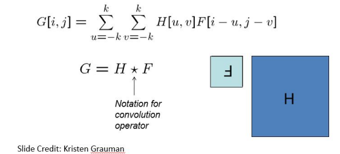

# Convolution
Convolution is a mathematical operation that combines two functions to produce a third functions to produce a third function. In the context of computer vision, it is not much different from cross-correlation as it still involves sliding a kernel/filter over an image, and computing a weighted sum (dot product) between the kernel and corresponding neighborhood of the image. 

Convolution can be used for a variety of purposes, including filtering, feature extraction, creating feature maps, etc.

## How does convolution work?
The steps for performing convolution can be specified as follows:
1. Create a filter (usually 3x3, sometimes bigger) for your specific task. 
2. Double flip the filter in both dimensions (bottom to top and right to left)
3. Perform cross-correlation
   

### If convolution is so similar to cross-correlation, and achieves similar tasks, why use convolution?
It turns out that convolutions have some very useful mathematical properties that make them preferable over cross-correlation in most image processing tasks.

The first property is **shift invariance**, which means that given the same kernel, convolution will behave the same regardless of the location within the image where it is applied. In other words, the value of the output of a convolution depends solely on the image neighborhood and the kernel, and not the position of that neighborhood within the image.

The second property is **superposition**, which states the following:
$(h * f_1) + (h * f_2) = h * (f_1 + f_2)$
Here, $h$ is the image, and $f_1$ and $f_2$ are filters we want to perform convolution with. What this property states is that if we want to perform convolution "back to back" with different filters, instead of doing those convolutions one after the other (which would be computationally inefficient since convolution is an expensive procedure), we can simply add the filters up and then **perform a single convolution across the image**. 

This is a massively useful property as it allows us to optimize our image processing tasks.

Here are some more properties of convolution that may be useful to look at:
1. **Commutative**  
   $$ f * g = g * f $$

2. **Associative**  
   $$ (f * g) * h = f * (g * h) $$

3. **Distributes over addition**  
   $$ f * (g + h) = (f * g) + (f * h) $$

4. **Can factor out scalars**  
   $$ kf * g = f * k g = k (f * g) $$  
   where $k$ is a scalar.

5. **Identity property**  
   The "identity filter" is  
   $$ f = [..., 0, 0, 1, 0, 0, ...] $$  
   and $$ f * e = f $$

While convolution is very useful, there are still some scenarios where correlation might be a better operation to use. 
Usually, a good rule of thumb is if you can do the task with both correlation and convolution, choose to do it with convolution due to its mathematical properties. 

Correlation is typically used when you want to:
- Measure similarity or detect patterns between two images or signals
- Find how closely two variables are related
- Detect a known pattern within a larger signal
- Determine time delays between similar signals

Convolution is used when you want to:
- Apply a filter or transformation to an image
- Combine two signals to produce a modified output
- Model how a system responds to input
- Blur, sharpen, or otherwise modify images
