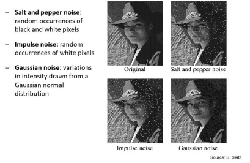
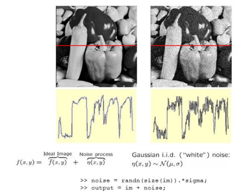
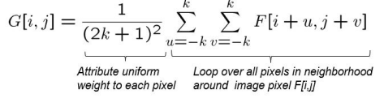
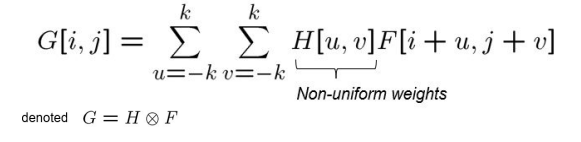
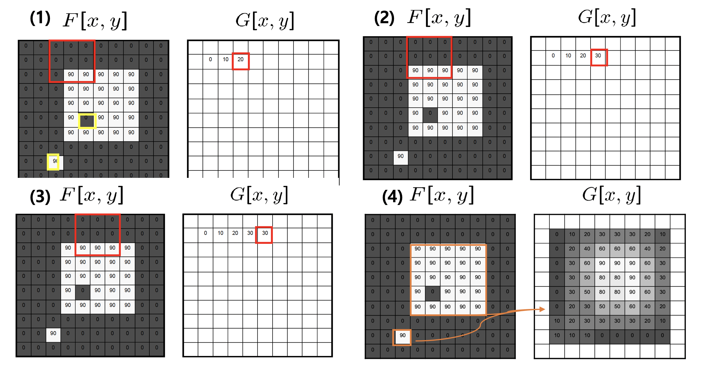
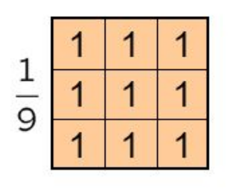
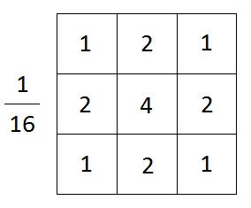

# Correlation Filtering
Our motivating example for exploring filtering will be **denoising** images.
## What is noise?
To understand what noise is, let's think about a scenario: let's say you are photographing an inanimate scene. Nothing about that scene is changing--not the lighting, not the position of the objects in the scene, etc.--everything remains exactly the same. If you took say, 10 pictures of that exact same scene, are those pictures going to be identical?

The answer is no. Why? Because the camera you use is made up of transistors and other hardware components that are subject to small fluctuations in performance. These small differences will make it so that even if the scene stays the exact same, the pictures will be slightly distorted and different each time. This inevitable distortion is called **noise**. Every image has noise, and there's not much you can do to prevent noise. There are ways, however, to **denoise** an image--that is, given a noisy image, remove that noise and retrieve the "ground truth" image.

But first, let's discuss the different types of noise:
### Types of noise
#### Salt and Pepper
Random black or white pixels scattered across the image.
#### Impulse
Random white pixels scattered across the image. 
#### Gaussian noise
Random noisy pixels with values sampled from a normal (Gaussian) distribution. Recall that normal distribution is parameterized by $(\mu, \sigma)$. $\mu$ is usually equal to $0$ (constant), whereas the value of $\sigma$ depends on how much noise you want in the image. A higher $\sigma$ means a blurrier image.

In our example, if we have 10 noisy pictures of the same scene, what can we do to denoise it?
The intuitive approach is to simply take the average of all the 10 images. This approach will work!

However, we don't always have the luxury of having multiple images of an identical scene (not only is that very difficult to get, it's also incredibly inefficient). So, the more important question becomes: when we a single noisy image, how do we go about denoising it?
## Linear filtering
Linear filtering is a process where we replace each pixel in an input image by a linear combination (weighted sum) of its neighbors
- the collection weights that you multiply each pixel by is called the kernel/mask/filter
A filter is nothing but a matrix with size equal to the size of the neighborhood, $p*p$ that you decide on.

Let's talk about two ways to apply a filter to an image:
### Correlation vs Cross-Correlation
In correlation filtering, we slide the the filter across each pixel in the input image, where the center of the filter should align with the current pixel. In this way, we coincide the filter and the neighborhood of the current pixel in the input image. 
Then, we multiply each pixel value in the input image by the corresponding weight in the filter, and sum the products. That final value becomes the value of the center pixel in the neighborhood. We repeat this process for every pixel in the input image.

This is the general idea of linear filtering. Within it, there are two slight variations in how we apply a filter to an image: correlation, and cross-correlation. 

In correlation:

We simply add up all in the values in the neighborhood, and divide by the number of pixels in that neighborhood. This final value becomes the value of the center pixel in the neighborhood. This is equivalent to performing cross-correlation with the filter having weights all equal to $1/(p*p)$. 

In cross-correlation:

We multiply each pixel value in the input image by the corresponding weight in the filter, and sum the products. That final value becomes the value of the center pixel in the neighborhood. 

### Moving average
Let's get back to the question of how to denoise a single noisy image. We mentioned that if we have multiply noisy images, we can simply average them to get the "ground truth", non-noisy image. We can do something very similar if we have a single noisy image. 

Instead of each pixel in the output/non-noisy image being the average of each corresponding pixel across images, each pixel will have a value equal to the average of all pixels in its neighborhood. 

Work through the image below to get an idea of what the moving average does. 

This moving average operation can be implemented via a filter. What would such a filter look like? Recall that moving average is nothing but correlation. Thus, the filter would look something like this, given that our neighborhood is of size $3*3$

Another name for this is the **box filter**; it is a filter that averages pixels within a neighborhood. 

### Gaussian filter
Another important type of filter to know is the Gaussian filter, which has values sampled from a normal (Gaussian) distribution. It is good at evenly smoothing/blurring images.

### What else can you do with correlation filtering?
All of the following tasks (and many, many more) can be achieved just through correlation filtering. All you really need to do is vary the weights in the filter/kernel, and the operation your filter does ends up being very different.

- Blurring images (using a Gaussian filter, as we just saw)
- Shifting images
- Dimming/brightening images
- Increasing/decreasing contrast
- Edge detection (coming up!)
- etc.

For examples as to how to use filtering to achieve these goals, look at the slides linked under "Resources" below.

## Resources
- [Lecture on Image Representation](https://www.youtube.com/watch?v=PyoJdMrUMqI)
- [Slides](week1_slides.pdf)
  

