# Edge Detection
Edges are crucial for visual perception, both for humans and machines. Humans primarily perceive images and objects in terms of edges. For example, if I gave you edges that correspond to an image of an animal (like below), you would very easily be able to identify that the animal in the picture is a cat.
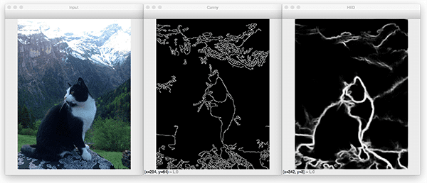

This is possible because edges capture the most important structural information in an image. 

Edge detection--that is, extracting edges from a given image, is useful for a variety of applications. Identifying edges allows machines to extract meaningful features from images. It can also allow us to compress images into a smaller form by simply storing the extracted edges.

In deep learning models, particularly CNNs (which we'll talk about later), edges also serve as low-level features that help identify key aspects of an image. The earlier layers in a CNN often learn edges first, while later layers learn more complex features that build off of this ability to detect edges.

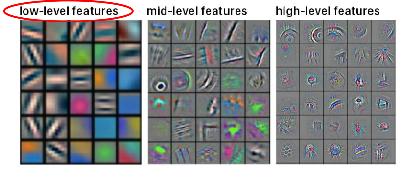

## What causes an edge?
Edges can be caused by a variety of visual reasons. Here are some of them:
- Changes in material properties: for example, there will be an edge between a rough material and a smooth material, if we laid them side by side
- Discontinuities in depth: recall that images are 2D representations of a 3D scene. In a 3D scene, depth is a separate dimension. In a 2D image, we can't really have depth. Thus, there will be an edge between an object and its background. 
- Variations in scene illumination/shadow: shadows and other differences in lighting cause edges!
- Discontinuities in surface orientation: once again, since an image is a 2D representation of a 3D scene, anytime an object wraps around itself, and the backside of the object is not visible, that discontinuity in the surface orientation (in the surface we are able to see) creates an edge. This might make more sense looking at the picture below. The column is wrapping around itself, creating a surface discontinuity.

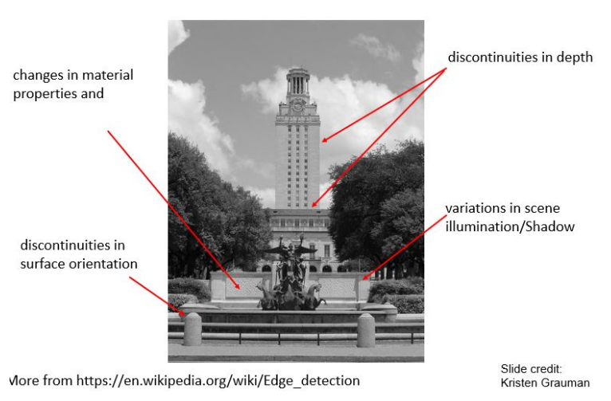

At their core, edges occur when there is a large difference in pixel intensities of pixels on either side of the edge. We notice this in the image above; if you zoom in, you'll notice that edges mark a place of rapid change in intensity of pixels on either side.

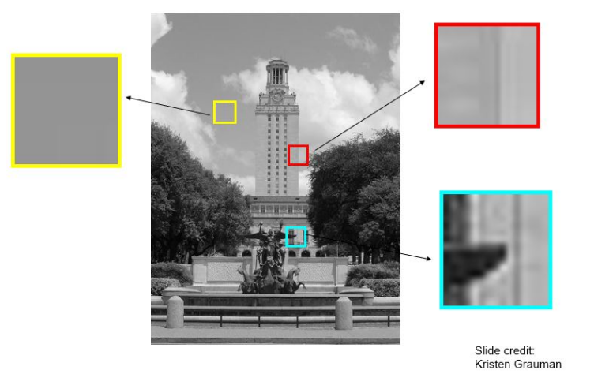

This idea is crucial to understanding how a computer might identify edges. While we as humans can visually identify edges based on the differences in pixel intensities, a computer will only be able to identify edges mathematically.  Thus, in "computer terms", we can define an edge as being a place of rapid change in the image intensity function. This rapid change can be identified by taking the derivative of the image intensity function, and identifying the extrema (which represent the points of greatest change in intensity). 

## Finding edges numerically via partial derivatives
Here is a visual example:

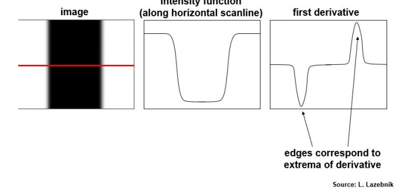

The image above has two edges: one on the left of the black rectangle and one to the right. The intensity function has value 1 corresponding to the white areas of the image, and has value 0 corresponding to the black areas of the image. The transition from white to black, and black to white mark the places of greatest change in intensity (edges!). Thus, by taking the first derivative of the intensity function, we can identify the edges in the image as they will correspond to the extrema. 

A valid question at this point is--how can it be possible to take a derivative of an image? How would we go about doing that? I mentioned above that we take the derivative of the image intensity function. In the real world, however, it is difficult to get a continuous intensity function corresponding to an image, since we are only given the discrete intensity values for each pixel. Thus, we don't compute the exact derivative (as you may be used to doing in calculus classes); instead, we compute an approximation of the first derivative for discrete data. The formula is as follows:
For 2D, continuous functions $f(x, y)$, the partial derivative is:
$\frac{\partial f(x,y)}{\partial x} = \lim_{\varepsilon \to 0} \frac{f(x+\varepsilon, y) - f(x,y)}{\varepsilon}$

For discrete data, we approximate the partial derivative using finite differences:
$\frac{\partial f(x,y)}{\partial x} \approx{f(x+1,y) - f(x,y)}$

Notice that I took the partial derivative with respect to x above. This corresponds to identifying **vertical edges**. If I instead want to extract **horizontal edges**, then I would need to take the partial derivative with respect to y, which would look like:
$\frac{\partial f(x,y)}{\partial y} \approx{-f(x,y) + f(x, y+1)}$
OR
$\frac{\partial f(x,y)}{\partial y} \approx{f(x,y) - f(x, y+1)}$

The idea here is that the **gradient points in the direction of most rapid change in intensity**. If I wish instead to detect diagonal edges (or edges at any orientation), I can combine the partial derivatives by finding the gradient magnitude and direction at each pixel, then filter out the pixels that have the desired magnitude and direction of the gradient. Those pixels that I filtered out will make up the type of edge I was looking for. 

The gradient magnitude is given by:
$\text{Magnitude} = \sqrt{\left(\frac{\partial I}{\partial x}\right)^2 + \left(\frac{\partial I}{\partial y}\right)^2}$
The gradient direction is given by:
$\text{Direction} = \arctan\left(\frac{\partial I}{\partial y}, \frac{\partial I}{\partial x}\right)$

To summarize, to detect edges at specific orientations like diagonals, the steps we take are as follows:
1. Calculate the gradient components at each pixel ($\frac{\partial I}{\partial x}$ and $\frac{\partial I}{\partial y}$)
2. Compute the gradient magnitude and gradient direction at each pixel
3. Filter pixels based on magnitude and direction to only get the pixels corresponding to the type of edge you desire
Filtering by direction lets you selectively detect edges at a particular orientation, and filtering for magnitude ensures that you're only keeping significant edges. When detecting diagonal edges (or edges at any orientation), the partial derivative with respect to x will give us the **vertical component** of the edge, whereas the partial derivative with respect to y will give us the **horizontal component** of the edge.

Now, a valid question at this point would be--how do I implement taking the derivatives of an image? The answer is that you can do this using convolutions!

### Using convolutions for taking derivatives
For simplicity, let's only consider vertical and horizontal edges. 
For vertical edges, the convolution filter would look something like this:

For horizontal edges, the convolution filter would look something like this:

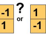

**Note**: in a previous set of notes, we said that in convolution, we double flip the filter first. Here, we assume that the filter is already double flipped for us. From now on, whenever we talk about a "convolution filter", we assume that it has been double flipped already, and all we have to do is perform the filtering operation (aka dot product/weighted sum, then replace the value of the center pixel with that value).

Notice that when you work the convolution operation out on an image, this works out to be exactly the approximate derivative formulas we see above. Let's try this now:

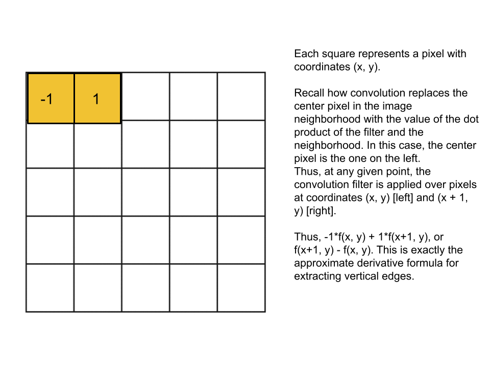

Note that the x-coordinate in this case measures the horizontal distance from the top left pixel, while the y-coordinate measures the vertical distance from the top left pixel. 

You can work this out for horizontal edges and convince yourself that the convolution works when taking the partial derivative with respect to y as well!

## The effects of noise
So far, our edge detection techniques have assumed no noise--this is hardly ever the case! In fact, forgetting to remove noise messes up the derivative-taking process quite a bit. Take a look below:

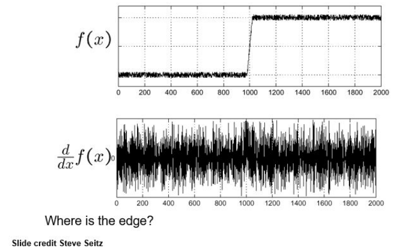

As you can see, f(x), the function representing the image intensities, is quite bumpy and noisy. Still, we are able to make our the general shape of the function; if we see this function in its digital image form, it is likely that we'd still be able to see and interpret it without much difficulty. However, when we take ethe derivative of this function, the extrema corresponding to edges are nearly impossible to extract!

The solution is quite simple; all we have to do is use the denoising techniques we talked about in a previous set of notes! We can even optimize that procedure here due to the mathematical properties of convolutions. Here, we can simply take the derivative of the smoothing filter we use to denoise, and then convolve it with the original noisy image. This denoises + takes the derivative all in one operation, a much faster procedure than having to first convolve the denoising filter and the noisy image, *then* taking the derivative. 

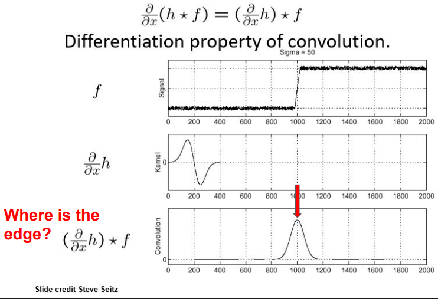

## Edge localization: Thresholding
Our current set of steps to identify edges is:
1. Suppress noise using a smoothing filter
2. Take the derivative of the denoised image
3. Find extrema, which correspond to edges
(Steps 1 and 2 can be combined in the optimization shown above)
However, there is a problem with Step 3. For real images, extrema can be of very different sizes. This means that we need to decide on how big an extremum has to be for us to classify it as an edge. If we include even tiny extrema as edges, we risk cluttering our final edge maps with insignificant/weak edges, or tiny noise and artifacts that weren't an edge in the first place. 

To solve this issue, we use a technique called **thresholding**. Thresholding is a very simple idea: we decide on some boundary for the size of extrema--if an extremum's size is above this boundary, then it is classified as an edge. If the extremum's size is below this boundary, then it is ignored and not classified as an edge. This boundary is called the **threshold**. 
The choice of this threshold is very important--it is a hyperparameter that we must set ourselves. Let's see what happens when we choose an incorrect value of the threshold:
- If the threshold we choose is **too low**: the resulting edge map will contain a lot of insignificant edges and artifacts--it is difficult to see where the true edges lie.

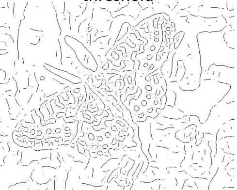
Image credit: Kristen Grauman
- If the threshold we choose if **too high**: the resulting edge map will contain disconnected and incomplete edges
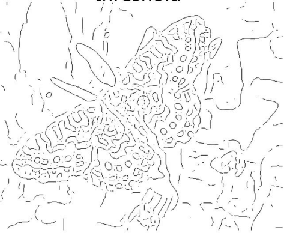
Image credit: Kristen Grauman

Traditional thresholding is a tricky business--it seems that whichever value you choose, you either have to deal with small artifacts in your edge map, or you have to deal with disconnected edges. It turns out that there is a more refined thresholding technique that performs much better: hysteresis thresholding. 

### Hysteresis thresholding
In hysteresis thresholding, instead of using just one threshold, we use two! We have a **high threshold** to start edge curves and a **low threshold** to continue them. How this works is as follows:
- If the gradient at a pixel is greater than the high threshold ($gradient > high$), we consider it an edge pixel
- If the gradient at a pixel is less than the low threshold ($gradient < low$), we consider it to NOT be an edge pixel
- If the gradient at a pixel is less than the high threshold but greater than the low threshold ($low < gradient < high$), we only consider it an edge pixel if and only if it is connected to an edge pixel directly or via other pixels. The following visual may provide more clarity:

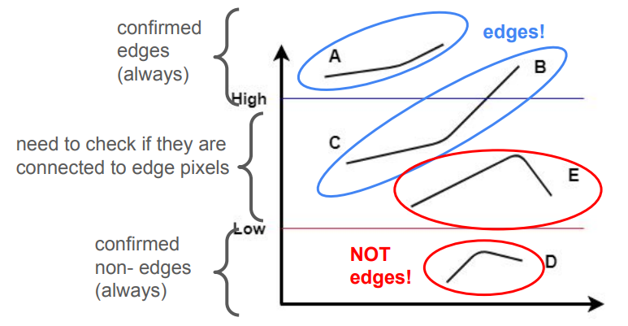

As you can see, any pixels with gradients above the high threshold are immediately classified as edge pixels, while any pixels with gradients below the low threshold are immediately classified as NOT edge pixels. For the pixels with gradients in between the two thresholds, we only consider it an edge if it is either directly or indirectly connected to a pixel that falls square into the "edge" category. If the pixel is not connected to a confirmed edge pixel (as we can see with the E pixels), we classify it as not an edge.

Hysteresis thresholding is a powerful technique for good edge localization--that is, the ability to accurately identify the exact spatial location of an edge, with minimal error, vagueness, or displacement from the true edge position. Hysteresis thresholding also helps with closing out disconnected edges. Overall, this is the best way to extract edges from image derivatives; however, it does require a fair bit of fine-tuning since we have not one but two hyperparameters to optimize!

## Non-maximum suppression
Edges can be further localized using a technique called non-maximum suppression. Non-maximum suppression involves only keep pixels that are the most important/significant for an edge. We do this by checking if a pixel is a local maximum along the direction of the gradient; we only classify it as an edge pixel if it is. The steps are as follows:
For each pixel, we:
- compute the orientation of the gradient at that pixel
- go along that gradient direction
- see if that pixel is a maximum along that direction
- if yes, retain it as an edge pixel
- if no, do not consider it as an edge pixel

## Real-life edge detector: Canny edge detector
If we use all of the above mentioned techniques, we end up with the Canny edge detector, developed by John F. Canny in 1986. It is still widely used as an edge detector in computer vision. To summarize, it follows these steps to detect edges:
1. Denoise the image
2. Take derivative of the image
3. Apply hysteresis thresholding to classify strong and weak edges
4. Perform non-maximum suppression to further localize edges

