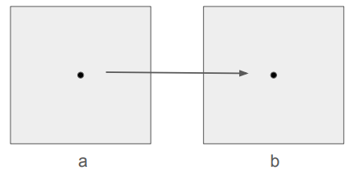
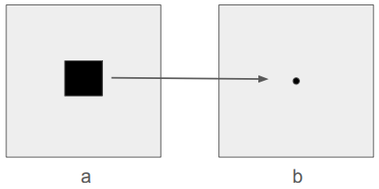
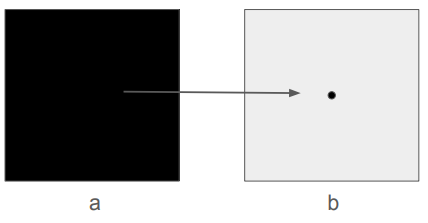

# Image Transformations
We've talked about how to represent images--but what can we do with these representations? It turns out that we can do lots of things to images when we have their numerical representations: including
- dimming/brightening the image
- rotating
- mirroring
- and much, much, more

Each of these tasks are called **transformations**; they can be achieved mathematically through an operation called **filtering.** We'll talk about filtering in more detail in the next chapter. For the time being, let's focus on the transformations themselves. Transformations can be broadly classified into one of three categories: point, local, and global. Let's explore what each of these are and where they are applied:

## Point transformations
Point operations operate on individual pixels. You can think of them as pixel-to-pixel operations, where the value of pixel $(m_i, n_j)$ in the output image comes from a transformation on the pixel $(m_i, n_j)$ (at the same coordinate location) in the input image.

This makes sense when we look at a visualization:

Point transformations are incredibly useful for tasks like:
- adjusting the brightness of an image
(Can you think of how to do this? If each pixel has an associated intensity, to evenly increase the brightness of an image, we would simply increase the intensity of each pixel by some constant value. This is a point operation.)
- contrast adjustment
(This one is a little trickier to think about. To increase the contrast of an image, we have exaggerate the differences from the mean for each pixel. Thus, this operation would look something like: $\alpha(I - I_m)$ where $I_m$ is the mean pixel intensity value in the image.)
- mirroring
(This is also a point operation. To mirror an image (flip over the y-axis), then each pixel $(x, y)$ in the input image would need to be mapped to position $(w-x-1, y)$ in the output image, where $w$ is the width of the output image).

Note that in computer vision, our input/output images are usually square (and if they're not, we resize them to be), and input/output images for image transformations tend to be the same size (this may not always be true, but we'll assume that it is for now).

## Local transformations
Local transformations modify a pixel based on its neighboring pixels. Output value $(m_i, n_j)$ is dependent upon the input values of pixels in a $p*p$ **neighborhood** of the corresponding pixel in the input image.

### What is a neighborhood? Why do we use it?
A neighborhood is the set of pixels immediately surrounding the current pixel. In computer vision, neighborhoods are very important because the pixels surrounding a pixel tend to be the most similar to it. 

For example, let's say we have the following image:

For any given pixels in this image, the pixels immediately surrounding in a certain $p*p$ window will be the most similar to it. For example, a pixel in the dashboard region will have a neighborhood that also makes up the dashboard. A pixel in the dark blue part of the sky will have neighbors that are also in that part of the sky. This principle is extremely crucial in almost every computer vision application.

Thus, a local operation looks like this:

Local operations are some of the most important transformations in computer vision.
- reducing noise
- filtering
- convolutions
- more!

## Global transformations
Output value $(m_i,n_j)$ is dependent upon all values in the input image. This is a little less used in computer vision, but is useful in cases where a **Fourier transform** is required. The Fourier transform breaks down an image into a sum of complex exponentials with different frequencies, phases, and magnitudes. The output of the Fourier transform is a representation of the image in the frequency domain. 

In the next section, we will talk in depth about filtering, a local operation.

## Resources:
[Lecture on Image Representation](https://www.youtube.com/watch?v=PyoJdMrUMqI)

