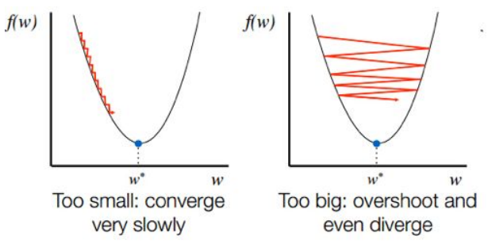
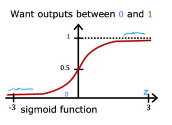

# Intro to Deep Learning: Machine Learning Fundamentals
We've now talked about some basic image transformation techniques and Computer Vision fundamentals. It turns out that Computer Vision today has advanced well beyond deterministic methods. Today, deep learning-based methods dominate--especially when it comes to generative models. In this and the next set of notes, let's dive into the basics of deep learning. 
Deep learning is a subcategory of machine learning that uses neural networks with many layers (thus "deep") that increasingly build higher and higher-order features from data. These networks learn representations of data by continuously adapting to massive datasets during training without manual feature engineering. They are able to solve complex problems like image recognition, natural language processing, and speech recognition.
## Why is deep learning so powerful?
Deep learning is powerful because:
- **It can learn very complex patterns that would be near-impossible to program manually.** One great example of this is AlphaGo, a deep learning model created by Google Deepmind in 2015 that learned to play the game Go. Go is a board game that is considered order of magnitude more complex than chess due to its larger board, more possible moves per turn, and greater strategic depth. To put things into perspective, a game of chess can have about $10^{120}$  possible permutations of the board, whereas Go can have more than $10^{360}$ permutations! The sheer number of permutations makes this is a very difficult task to code, but deep learning is extraordinarily good at it, even beating the world champion, Lee Sedol!
- **Deep learning scales with data**. Unlike traditional algorithms, deep learning models typically get better as they see more examples, allowing us to take advantage of Big Data.
- **No need for manual feature engineering**. Unlike traditional ML models, where we may have to tune which features of the data to feed to the model and which ones to leave out (this requires extensive domain knowledge of the task), deep learning models have the ability to learn which features are important/not important directly from the data itself, and weigh them accordingly when making predictions.
- **Deep learning is versatile**. The same types of models can be applied to a variety of very different tasks. 

## Basics of Machine Learning
Before we dive into deep learning, it is necessary to get a high-level understanding of machine learning, as most deep learning topics build off of these foundational concepts. Machine learning is the field of study that gives computer the ability to learn without being explicitly programmed to do so. The more opportunities (more data) you give a model to learn, the better it will perform. There are two main types of machine learning: supervised and unsupervised ML. 

### Supervised Learning
Supervised learning algorithms learn input to output mappings. The data they are trained on is required to have "labels" that correspond to the "correct answer" given a set of inputs. Each set of inputs and outputs are called "examples" in the dataset.
This is best illustrated with an example. Let's say we are trying to train a model to predict house prices. The input data we feed the model could include: the number of rooms, square foot area of the house, number of bathrooms, year of construction, whether or not the house has a pool, etc. The output would be the price of the house, and for each set of input features, the dataset will have a "correct" answer, which in this case would be the real-life price of the house. Our goal here would be to predict a price that is as close to this real-life (ground truth) price of the house as possible.
In the above example, the value we are trying to predict is a continuous numerical variable. Thus, this type of supervised learning falls under the category of **regression**, which allows you to predict a number from a set of infinitely many possible outputs. 
Another type of supervised learning is classification, which predicts a category/class from a finite set of outputs. Let's explore each of these in more detail.

### Linear Regression (with one variable)
A linear regression model is trained using a training set, which consists of features (inputs) and targets (correct answers). The learning algorithm produces a function $f$ that maps a new input $x$ and outputs a prediction, $\hat{y}$. This function is called the model. Our goal is to create a model with weights such that, when given a new input $x$ that it has not seen before in the training set, it is able to output a prediction $\hat{y}$ that is as close as possible to the target (true value) $y$.

**Note**: Linear regression in one variable simply means that we only have one input feature that is being converted to an output. You will see later on that we may want our model to be trained on multiple different features, in which case we will use linear regression with multiple variables.

Formally defined, a univariate linear regression model looks like the following:
$f_{w, b} = wx + b$
where $w$ and $b$ are called parameters/weights/coefficients.

Now, a valid question at this point may be: given some weights $w$ and $b$ for our model, how do we know how *good* our model is? How do we know how well it is performing in making predictions as close to the ground truth values as possible? This is where cost/loss functions come into picture.

### Loss functions (also known as cost functions)
Loss functions are often denoted by $J$. A loss function tells us how far off our predicted values are from the target values, allowing us to evaluate our model and improve it if required. The goal is to have parameters $w$ and $b$ such that the loss function $J$ is minimized. There are many different possible loss functions that we will explore in due time. For now, let's just look at one of the simplest and most popular loss functions: mean-squared error (MSE):
$\text{MSE} = \frac{1}{n} \sum_{i=1}^{n} (y_i - \hat{y}_i)^2$
- $n$ is the number of data points
- $y_i$ is the observed (true) value
- $\hat{y_i}$ is the predicted value
Essentially, we compute the average square difference between the true and predicted value across all the data points, resulting in a single numerical value that lets us know how accurate our model's predictions are.

Loss metrics like this are essential for optimizing the values of the model through a process called gradient descent.

### Gradient descent
Gradient descent is an algorithm that allows us to optimize the model's parameters such that they minimize the loss function. On a high level, gradient descent follows these steps:
1. Start with some arbitrary values for parameters $w$ and $b$
2. Keep updating $w$ and $b$ in a loop to reduce $J_{w, b}$ until we settle at or near a minimum. 

More formally, at each step (iteration) of gradient descent, we perform the following update to the parameters:
$w = w - \alpha \nabla J_{w, b}$
$b = b - \alpha \nabla J_{w, b}$
Where $\alpha$ is a hyperparameter known as the learning rate.
Note that the above updates are happening simultaneously, not one after another. In other words, the cost function value for the updates of both $w$ and $b$ is the same; the cost is not being re-computed after updating $w$. 

Thus, the steps for gradient descent can be summarized in more detail:
1. Start at arbitrary values for $w$ and $b$
2. Set a learning rate $\alpha$; make sure it is not too big and not too small)
3. Take steps in the direction opposite of the gradient of the loss function (this takes us towards the minimum!)
4. Simultaneously update $w$ and $b$. 
5. Repeat until convergence to a minimum. 

There are a couple of things to unpack here. 
Firstly, we know that in gradient descent, we want to ideally get to the global minimum of the loss function, as that means that our model is as accurate as it can get. We know we are at a global minimum when the gradient of our loss function is 0, in which case we have converged and cannot take another step in any direction (since the update term $\alpha \nabla J_{w, b}$ will get zeroed out in the gradient descent formula). However, the gradient of the loss function can also be zero when we are at a local minimum instead of a global minimum. 
#### What happens when we are stuck at a local minimum?
It is difficult to know if we get stuck at a local minimum, since gradient descent will have appeared to have converged, and we will have no idea that we are still not at the most optimal values of the parameters. This is where experience comes in handy--if the accuracy of your model is not at a reasonable value that can be expected for that particular model/loss function, then you might be able to figure out that the gradient descent algorithm got stuck at a local minimum. In that case, you can simple re-run the algorithm and see if you get better accuracy. 
#### What happens if we get stuck at a maximum?
Another problem we must consider has to do with the random initialization of the weights. What if we accidentally choose values of $w$ and $b$ that correspond to a maximum, where the gradient will also be 0? This is a much easier problem to diagnose, as the gradient descent algorithm will converge immediately, and your accuracy will be very poor. In this case, re-running the algorithm might do the trick. Note: this is also an extremely, extremely rare problem.
#### Avoid dealing with this in the first place: use convex loss functions!
To avoid dealing with the complexities of getting stuck at local minima or maxima, we usually construct loss functions such that they are convex functions. In other words, these functions are smooth and bowl-shaped such that they have no bumpy surfaces resulting in local minima/maxima; instead, they have a single global minimum. This means that gradient descent will converge to the most optimal values of $w$ and $b$ every single time. MSE is a convex loss function, as are other commonly used loss functions in machine learning such as binary cross-entropy.
#### Where relying non-convex loss functions falls short
Inevitably, (especially when we get into deep learning) we may have to use more complex loss functions that aren't convex. This usually occurs when you're using some sort of custom loss function that is specific to the task you are training your model to solve. It is also a common problem in deep learning models which may require more complex combined loss functions such as cross-entropy with softmax, or hinge loss for linear SVMs. We see non-convex loss functions quite often in generative models especially, such as GANs and variational autoencoders. 
It is also important to note that while the MSE loss function itself is convex, when it is used as the overall loss for deep neural networks, the optimization problem becomes non-convex. This is because deep neural networks apply multiple layers of non-linear transformations (also called activation functions; we will cover these in detail soon). While the MSE loss is convex with respect to its direct inputs, the overall loss landscape becomes non-convex due to the composition of these nested non-linear functions throughout the network.
#### Optimizing for non-convex loss functions
To address the challenges of optimizing non-convex loss functions, we can use a more advanced form of gradient descent called **Stochastic Gradient Descent (SGD)**. This is most commonly used gradient descent algorithm in deep learning. It works by using mini-batches and introducing noise to sometimes bounce out of shallow local minima. We can also use advanced optimizers such as Adam, RMSprop, etc. that have additional bells and whistles that allow them to navigate the loss landscape more effectively. There are so many more techniques, which I'll just briefly list below:
- Momentum methods
- Learning rate scheduling
- Multiple random initializations
- Simulated annealing
You don't have to know all of these to do deep learning, but if you're curious there are a wealth of articles, blogs, and lectures freely available on the Internet to help you understand them better. 
#### A brief look at the different types of Gradient Descent
There are three main types of gradient descent, each used for a different purpose. We'll briefly cover them here so that you are familiar with them at least on a high level. 
- Batch Gradient Descent: processes the entire dataset in one go at each step; is the most stable out of the three and produces the best estimate of the gradient. However, it is very memory intensive and slow per update.
- Mini-batch Gradient Descent: is a fairly standard approach in ML; processes chunks of data (e.g., 32-512 samples) at each time. Has the best balance of stability and speed of convergence.
- Stochastic Gradient Descent: Processes one sample at a time; has the fastest updates and lowest memory usage. Does noisy updates to help escape local minima (thus is good for dealing with non-convex loss functions). Is not as stable. 

### Setting the learning rate
Another thing we haven't yet discussed in detail is what the value for the learning rate should be. In the section on gradient descent, we discussed that the learning rate is a hyperparameter that determines the step size, or size of the update that occurs to the parameters $w$ and $b$. But what value should this learning rate take? What happens if we set it to be an incorrect value? Let's explore that question in this section. 
Choosing the learning rate $\alpha$ is one of the most important steps for a successful gradient descent (GD). 
- The higher the learning rate, the faster GD converges, but also the more likely it is to diverge (never find the minimum). 
- The smaller the learning rate, the more accurate GD is in finding the minimum; however, the algorithm runs extremely slowly and it takes a incredibly large number of iterations to locate the minimum. This wastes resources and takes a lot of computing power. 
The learning rate should thus be somewhere in the middle--neither too high nor too low. It takes trial and error to determine the best learning rate for your specific model.

In general, a learning rate of 0.01 or 0.001 is a good starting point for training generative models. You can then play around with the learning rate and see if you get a better result by increasing or decreasing it.

### Logistic regression
Logistic regression is another type of regression that is used for binary classification. It uses a function known as the sigmoid function, which has an equation of the form below:
$g(z) = \frac{1}{1 + e^{-z}}$ where $z = wx + b$

The logistic regression function transforms/squishes its inputs into an output between 0 and 1. 
If $z$ is a large positive number, $g$ approaches 1. 
If $z$ is a large negative number, $g$ approaches 0. 
This is perfect for binary classification since we can attribute one class to 1 and the other class to 0, and the output (since it is between 0 and 1) can be treated as a probability of the input x belonging to class 1. If the model's output is >= 0.5, the input will be classified as class 1. If the model's output is < 0.5, the input will be classified as class 0. 
0.5 in this case is called the **decision boundary**. The decision boundary is a probability threshold (this is the same idea as thresholding, which we talked about regarding edge detection!). 0.5 is a common choice for the decision boundary, but it is a hyperparameter that can just as well be any other value depending on the nature of the data.

### Multiple linear regression
When discussing the univariate linear regression model, we said that the univariate model can only take one feature into account. We also said that there is another type of linear regression model that can take more than one feature into account when making a prediction. Such a model is called a **multiple linear regression model**. Multiple linear regression extends the univariate model by incorporating several input features rather than just one. When working with real-world data, we rarely find that a single variable can adequately predict our target. Instead, we typically have multiple factors that influence the outcome we wish to predict.

A multiple linear regression model is trained using a training set containing multiple features (inputs) and their corresponding targets (correct answers). The learning algorithm produces a function that maps a new input vector $x$ containing multiple features to output a prediction $\hat{y}$. Formally defined, a multiple linear regression model looks like the following:

$f_{w, b}(x) = w_1 x_1 + w_2 x_2 + ... + w_n x_n + b$ 
Where 
$w = [w_1, w_2, ..., w_n]$ is a vector of weights corresponding to each feature
$x = [x_1, x_2,...,x_n]$ is the input feature vector, and
$b$ is the bias term (equivalent to the intercept); there is still only one bias term. 

We can express this more compactly using vector notation:
$f_{w,b} = w \cdot x + b$
Our goal remains the same as in univariate regression: to find the optimal parameters $w$ and $b$ such that when given new input features the model hasn't seen before, it produces predictions $\hat{y}$​ that are as close as possible to the true values $y$. 

**Note**: While univariate linear regression can be visualized as a line in 2D space, multiple linear regression with two features corresponds to a plane in 3D space, and models with more features represent hyperplanes in higher-dimensional spaces. Despite this increased complexity, the underlying principle remains the same: finding the hyperplane that best fits our data.

### The issue of overfitting 
A common problem in ML models is **overfitting**. Overfitting means that the model fits the training data too well to the point that it is unable to generalize to brand new examples. You can tell when a model is overfit when the training set accuracy is high, but the test set accuracy is low (we will talk about the difference between the train set and test set soon). Overfitting is kind of like memorizing the answers to practice questions in preparation for an exam, and then not being able to solve any problems on the exam since they require knowledge of the underlying patterns and concepts, and not rote memorization of the practice problems (the training set). 
On the other extreme, another problem that ML models can face is **underfitting**, which is when the model simply does not fit the training data well enough; because of this, it is also unable to generalize to brand new examples. We can diagnose underfitting by seeing that the training set accuracy is low, as well as the test set accuracy. This is the equivalent of not studying for a test, so being unable to solve both practice problems as well as problems on the exam. 

Underfitting is both common and relatively simple to solve. All models are initially underfit, as their parameters are not the most optimal for the given task. To fix underfit models, we can train them longer, train them on more and better quality data, use feature engineering, and try tuning hyperparameters, like the learning rate.

Overfitting is a more challenging issue. It is also fairly common, especially in more complex models such as deep neural networks. Solving overfitting can be a little tricky since we will need to strike a balance between not being overly close to the training data, but being close enough to learn the important patterns. Let's look at some of the most commonly used techniques for fixing overfitting:
- **Train on more data**. By training on mode data, the model is less likely to tend towards an overfit solution. This is easier to think about in terms of regression. The fewer data points we have, the easier it is to come up with a specifically-shaped line that goes through all of those points. If we have more and more data points, coming up with such an overfit line becomes more and more difficult. 
- **Remove/drop features**. Overfitting is often caused by including more features than are necessary. By dropping unnecessary features, we can ensure that the model is only learning what is strictly required to make accurate predictions. However, this is a risky technique. Knowing which features to drop requires extensive domain-specific knowledge of the task at hand--furthermore, even with this expertise, there is never a guarantee that the feature you are dropping is truly irrelevant. Indeed, a lot of discoveries have been made using ML models, which found out a relationship between a previously overlooked feature and the output. Thus, by removing features, we risk our model losing potentially critical information. A better option, thus, is to use regularization.
- **Regularization**. Overfit models tend to have large values for its parameters. Instead of outright removing features, regularization simply assigns a lower weights to them (it subdues them instead of setting their weights to 0). It involves multiplying all the weights by a **regularization parameter**, which is yet another hyperparameter.

Overfitting is also called high variance, and underfitting is also called high bias.
### Classification
So far, our only taste of supervised learning has been regression. Let's now explore a different type of supervised learning, called **classification**. Unlike regression, classification tasks only have a finite number of possible outputs, which are categorical variables. Let's explore the different types of classification tasks:
#### Binary classification
Binary classification involves categorizing data into exactly two classes. The model learns to distinguish between two possible outcomes, often represented as 0 and 1, or positive and negative. For example, predicting whether a patient has a disease or not (only two possible outcomes!). 

Formally, a binary classification model can be expressed as:
$f_{\mathbf{w}, b}(\mathbf{x}) = g(\mathbf{w} \cdot \mathbf{x} + b)$
Where $g$ is typically a sigmoid function that maps the output to a probability between 0 and 1. This is the logistic regression model we discussed in a previous section.

#### Multi-class classification
Multi-class classification extends binary classification to problems with more than two categories. Instead of distinguishing between just two classes, the model must learn to correctly identify which of several possible classes an instance belongs to. For instance, predicting whether the weather is either Sunny, Rainy, Cloudy, or Snowy.

A multi-class classification model can be formally represented as:

$f_{\mathbf{w}, \mathbf{b}}(\mathbf{x}) = \text{softmax}(\mathbf{w} \cdot \mathbf{x} + \mathbf{b})$

where $\mathbf{w}$ is a matrix of weights with one row per class, and the softmax function converts the outputs into a probability distribution across all classes:

$\text{softmax}(z_i) = \frac{e^{z_i}}{\sum_{j=1}^{k} e^{z_j}}$

#### Multi-label classification
Multi-label classification is different from multi-class classification in that instead of the output being one of many classes, it can belong to multiple categories. For example, when presented with an image of a cat and a bird, instead of predicting whether an image shows a dog, cat, OR bird, the model can output multiple relevant labels (in this case, the model would output cat AND bird)!

A multi-label classification model typically produces multiple outputs, one for each possible label:

$f_{\mathbf{W}, \mathbf{b}}(\mathbf{x}) = [g_1(\mathbf{w}_1 \cdot \mathbf{x} + b_1), g_2(\mathbf{w}_2 \cdot \mathbf{x} + b_2), ..., g_k(\mathbf{w}_k \cdot \mathbf{x} + b_k)]$

where each $g_i$ is often a sigmoid function determining whether the corresponding label applies.

#### Imbalanced classification
Imbalanced classification refers to problems where the classes are not represented equally in the training data. Some classes may have significantly more instances than others, creating a challenge for the learning algorithm as it may bias toward the majority class if we used a different type of classification. This type of classification is most relevant for tasks like fraud detection. Let's say a bank is trying to train a model to identify fraudulent transactions. It likely has a dataset of day-to-day transactions, out of which a very small number are actually fraudulent. With this imbalanced representation in the dataset, how can we possibly get the model to learn to identify a class that is rare? 

When working with imbalanced datasets, the standard classification model must be adapted:

$f_{\mathbf{w}, b}(\mathbf{x}, \mathbf{c}) = g(\mathbf{w} \cdot \mathbf{x} + b, \mathbf{c})$

where $\mathbf{c}$ represents class weights or other adjustments to account for the imbalance.

## Unsupervised learning
Unsupervised learning is a type of machine learning where the algorithm learns patterns from data without labeled responses or correct answers. Unlike supervised learning, which maps inputs to known outputs and uses labelled data, unsupervised learning algorithms work with data that have no predefined target variable. The goal is to model the underlying structure or distribution of the data to learn more about it.

Formally, an unsupervised learning algorithm takes a dataset $\mathcal{D} = {\mathbf{x}^{(1)}, \mathbf{x}^{(2)}, ..., \mathbf{x}^{(m)}}$ containing $m$ unlabeled examples and produces a model $f$ that captures meaningful patterns within the data. These patterns may represent groupings, densities, or lower-dimensional representations of the original data. There are a couple of important applications of unsupervised learning. Let's take a brief look at them below:
- **Clustering**: grouping similar instances together based on feature similarity
- **Dimensionality reduction**: transforming data from a high-dimensional space to a lower-dimensional space while continuing to preserve important relationships
- **Anomaly detection**: identifying unusual patterns that do not conform to expected behavior
- **Association rule learning**: discovering relationships between variables in large databases
Unsupervised learning plays a very important role in generative models. Variational autoencoders, for example, use dimensionality reduction to map input data to a latent space. We will discuss this in a lot more detail in the future, so keep this idea in the back of your mind for now.
### K-means clustering
K-nearest neighbors is a form of clustering. A clustering algorithm looks at a set of data points and automatically finds trends and similarities within and amongst that dataset. This is different from supervised learning because in supervised learning, the dataset includes the target output $y$. In unsupervised learning algorithms such as this one, the dataset only contains the features $x$, but there are no set/"correct" output labels. Instead of correctly predicting an output, unsupervised learning algorithms work to find some interesting structure of trend in the data. A clustering algorithm is a specific kind of unsupervised learning that tries to find groups of similar data points, or clusters.

The K-means clustering algorithm requires you to specify how many clusters (groups) you want the algorithm to look for. Later on, we will explore how to determine how many clusters to look for, but for now let's assume that we already know how many we need, and first understand how the algorithm works. Let's say you are looking for $K$ clusters. 
1. The algorithm will randomly initialize $K$ points that could be possible centers of the clusters (called **cluster centroids**)
2. The algorithm will then iterate through all the data points and will assign a label to each data point that indicates which cluster centroid it is closest to (the label is essentially an index from 1 to K (or, alternatively, from 0 to K-1)). Mathematically, this can be written as: $c^{(i)} = \min_k \|x_(i) - \mu_k\|^2$
3. For each cluster (data points that were labelled the same), the algorithm will take an average and move the cluster centroid to that average. The way to compute this average is by first taking the mean of feature 1, then feature 2, all the way up to feature $n$. If you visualize the data points as a graph, with each feature corresponding to a single dimension, then the point $P(mean(feature_1), mean(feature_2),...,mean(feature_n)$ is the mean of the cluster. This is the new location of the cluster centroid.
4. If you keep repeating these steps, you will reach a point where there is no change to the labels of the data points or the location of the cluster centroids. This means that at this point, the K-mean clustering algorithm has converged.

**Note**: what do you do if a cluster is assigned no data points? If a cluster has no data points assigned to it, it means that the cluster centroid is too far away from the rest of the data. This can pose a problem because having 0 data points would cause undefined behavior when computing the average. Thus, ML engineers usually either (1) re-initialize the cluster centroid in the hopes that it will get more data points if the location is different, or (2) get rid of the cluster entirely, so you don’t have K clusters anymore (this is most common).

What about less well-defined data (data that is not very well separated)? K-means still works! You can still use K-means for less well-separated data.
#### K-means loss function
Just as we’ve seen algorithms trying to minimize a cost function in supervised learning, K-means also has a cost function that it works to optimize, so that it knows when to stop iterating. The cost function for K-means essentially minimizes the distance formula we saw in the above section.

Recall that the K-means algorithm wants to find centroids ${\boldsymbol{\mu}_1, \boldsymbol{\mu}_2, ..., \boldsymbol{\mu}_K}$ and labels $c^{(i)} \in {1, 2, ..., K}$ for each data point $\mathbf{x}^{(i)}$ that minimize the within-cluster sum of squares, known as the distortion function:
$J(c^{(1)},...,c^{(m)},\boldsymbol{\mu}_1,...,\boldsymbol{\mu}_K) = \frac{1}{m}\sum_{i=1}^{m}||\mathbf{x}^{(i)} - \boldsymbol{\mu}_{c^{(i)}}||^2$

where:
- $c^{(i)}$ is the index of the cluster to which data point $\mathbf{x}^{(i)}$ is currently assigned
- $\boldsymbol{\mu}_k$ is the cluster centroid $k$
- $\boldsymbol{\mu}_{c^{(i)}}$ is the cluster centroid of the cluster to which example $\mathbf{x}^{(i)}$ has been assigned

Using this loss function, K-means works like this:
1. Select $K$ initial centroids $\boldsymbol{\mu}_1, \boldsymbol{\mu}_2, ..., \boldsymbol{\mu}_K$ (usually chosen randomly from the data points)
2. Assign each data point to the nearest centroid
3. Recalculate each centroid as the mean of all points assigned to it
4. Repeat steps 2 and 3 until the labels do not change (or a maximum number of iterations is reached)
#### Picking a good value for K
Up until this point, we said to assume that the value of $K$ was pre-determined. Let's fill in that gap now! As you may have guessed, $K$ is a hyperparameter. There are several methods for determining an appropriate value of $K$, such as the elbow method, silhouette analysis, and gap statistics. Let's discuss the elbow method in more detail, as it is one of the most commonly used one. 

The elbow method is implemented as follows:
- Try running K-means with many different values for $K$, the number of clusters
- Plot a graph of the number of clusters against the cost function $J$. 
- Find the elbow (turning point) in the graph where the rate of decrease of cost changes and begins to flatten out
- The number of clusters corresponding to that point is the ideal value for $K$

However, this method is not fool-proof because for most applications, the correct value for $K$ is often ambiguous. You might notice that when you graph $K$ vs. $J$ for many applications, it is a smoothly sloping curve and there are no elbows.
##### How do you choose a value for K when the elbow method fails?
Understand that the whole point of using clustering is for some downstream purpose. For example, you may be using clustering to group similar websites together. Thus, you should evaluate K-means based on how well it performs on that later purpose.

**Note**: do not pick the value of $K$ based on which one yields lowest cost; as $K$ increases, cost decreases, so if you go that route, you will end up picking the max value for $K$ every time, which defeats the purpose of clustering and will not yield accurate results for your purpose.

## General tips and tricks for training good ML models
### Training, validation, and test sets
Before training any model, we divide our data into three separate datasets. Each of these sub-datasets serve an important purpose. The standard approach many years was to simply divide the dataset into two sets: training and testing. The training set was used to train the model as it learns optimal parameters, while the testing set was used to evaluate the performance of the trained model. However, this proved to be a faulty technique because once ML engineers training their model saw the model's performance on the testing set, they would inevitably make adjustments to the model, and re-evaluate on that same testing set. This introduced a bias in the performance metrics of the model, as it was not a "blind test" anymore--the model had been tweaked to perform better on the test set, so the evaluation we did using the test set wasn't accurate anymore!
Thus, we now use three sets: the training, validation, and test set. The training set serves the same purpose as before, and the validation set serves a similar purpose as the test set before. The validation set is used to determine what model adjustments are needed. The test set, however, is very different from before. The ML engineer does not ever see the contents of the this test set. It is hidden away, and not used until the very, very end--when the engineer has finalized the model. It is used purely for evaluation purposes.

ML engineers tend to split their datasets with the following ratios: 80 (training)-10 (validation)-10 (testing), or 70-15-15. 
### Feature normalization
Normalizing or standardizing your features ensures no single feature dominates the learning process simply because of its scale. In our house price prediction example, the square footage might range from 1,000 to 10,000 while the number of bathrooms might range from 1 to 5. Without normalization, the square footage would have a disproportionate influence on the model's learning.

The two most common approaches are:
- **Standardization**: Transforms features to have zero mean and unit variance
- **Normalization**: Scales features to a fixed range, typically [0, 1]
### Model complexity progression
Always start with simpler models before moving to complex ones. For example, it is wise to start with linear regression before trying more complex models like random forests or neural networks. This approach provides a reasonable baseline to compare against as well as a way to identify if your problem actually requires complex modeling, or if it can be solved just as well with a simple model.
### Learning rate scheduling
The learning rate controls how quickly your model updates its parameters during training. A good strategy is to begin with a higher learning rate to quickly approach the solution space, and then to gradually decrease it over time to fine-tune to prevent overshooting the optimal solution. 6

This approach, often called learning rate scheduling, helps balance between convergence speed and stability.

## Resources
A lot of the content from this blog was taken from Andrew Ng's Machine Learning Specialization on Coursera. If you're new to ML, I recommend doing it. It provides a good high-level overview of ML. It's not very math-focused, but is good for picking up the general concepts:. You can audit it for free [here](https://www.coursera.org/specializations/machine-learning-introduction). 

Some resources for understanding gradient descent:
- Medium article: ["Convex vs. Non-Convex Functions: Why it Matters in Optimization for Machine Learning"](https://rumn.medium.com/convex-vs-non-convex-functions-why-it-matters-in-optimization-for-machine-learning-39cd9427dfcc)
- [3b1b Gradient Descent lecture](https://www.youtube.com/watch?v=IHZwWFHWa-w)

