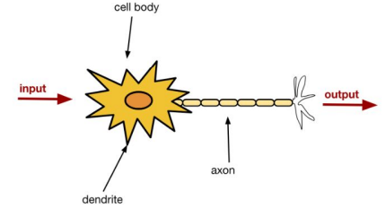
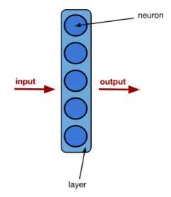
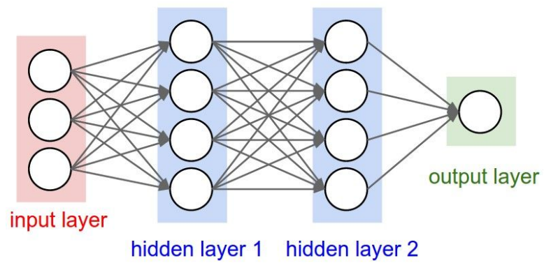
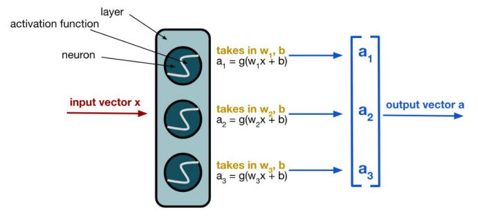
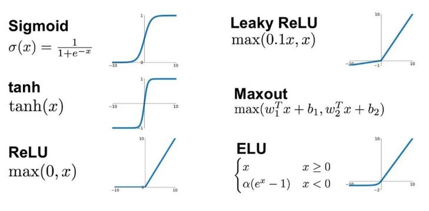

# Intro to Deep Learning: Neural Networks
Neural networks have come a long way since their creation in the 1960s! Initially, researchers like Frank Rosenblatt developed the **perceptron**, an early model of a neural network, with the ambitious goal of mimicking the human brain. The idea was that, just as biological neurons work together to process information, artificial neurons could do the same in a computational setting.

Early efforts in neural networks and deep learning focused primarily on speech recognition laying the foundation for natural language processing (NLP) as we know it today. Computer vision, despite its prominence now, was a later addition to the deep learning field, only emerging as a major subfield once deep learning architectures became more powerful. Computer vision did exist as an independent field, but most of the methods used at the time were probabilistic, not ML-based.

Fast forward to today, and neural networks have expanded into nearly every domain—powering everything from medical diagnostics to autonomous vehicles. However, despite the biological inspiration behind their origins, modern neural networks have little in common with the way the human brain actually functions. We still use terms like neurons and "firing" in neural networks, but these have a totally different meaning than in biology.

## What is a neuron?
Brains contain neurons, which are cells that serve as processing units and send electrical pulses (outputs) to other neurons, which take those outputs as inputs. In a neural network, “neurons” make up layers and do pretty much the same thing--instead of sending electric pulses, neurons send information and data to other neurons.

## How does a neural network work? (high-level)
Neural networks are nothing but a collection of interconnected layers! Layers are groups of multiple neurons together. The output of one layer becomes the input of another layer, and each layer's inputs are called activations (we'll cover activations in a section coming up). 

The structure of a neural network has a specific terminology. The first layer is called the input layer, which receives the initial data. The final layer is the output layer, which produces the network's prediction or classification. The layers in between these two endpoints are called the hidden layers. 

In practice, neural networks still implement some form of linear regression, but with added complexity. Each neuron performs a calculation similar to regression on its inputs, applying weights to each input value and adding a bias term. The key difference is that these calculations happen repeatedly across multiple layers.

Essentially, the neural network performs linear or logistic regression over and over again throughout its structure. Each neuron takes inputs, calculates a weighted sum, applies an activation function, and passes the result to the next layer. This layered approach allows neural networks to learn increasingly complex patterns and relationships in data, making them powerful tools for a wide range of applications.

## Forward propagation
Forward propagation is the technique used to move data from one layer to another. In each layer, the data gets transformed in some way before it is propagated to the next layer. This is how it works:
Each neuron in a layer outputs a value, which becomes an element in the layer's output vector $a$. This output vector becomes an input vector to the next layer. This process of the output of one layer becoming the input of another layer is called **forward propagation**. On a high-level, forward propagation looks like this:

Note that this image does not show activation functions; it is a highly simplified visual of how data is forwarded through a network. 

## A closer look -- activation functions
Recall how we said that neurons are little regression units. Let's explore that idea more in this section. 
A single neuron contains weights $w$ and $b$ and computes $w_1x_1 + w_2x_2 + ... + w_nx_n + b$ on its inputs $x$. We then send the neuron's output through an **activation function** before propagating it to the next layer. What is an activation function? Why do we need it?

Well, let's imagine what would happen if we did not send the neuron's output through an activation function. This would be the equivalent of stacking multiple layers of linear functions, like this:
$\text{Layer 1 output} = a_1 = w_1x + b_1$
$\text{Layer 2 output} = w_2(a_1) + b_2 = w_2(w_1x + b) + b_2 = (w_2w_1)x + (w_2b_1 + b_2) \rightarrow wx + b$
Since we are simply stacking linear functions, we end up with a linear functions. This means that without activation functions, our neural networks would never be able to learn anything more complex than a linear model! 
Activation functions, thus, have the purpose of adding a non-linear component after each layer, which allow us to learn complex patterns that go beyond simple linear relationships.

Neurons in a layer typically have the same activation function. Thus, in practice/implementation, we just add an "activation layer" after each layer, like this:

self.fc1 = nn.Linear(input_size, hidden_size) 
self.relu = nn.ReLU()  # Activation function

Here are some of the most commonly used activation functions:
- Sigmoid: used for binary classification output layers
- Softmax: used for multiclass classification output layers
- Tanh: used for zero-centered outputs
- ReLU: standard activation function
- Leaky ReLU: version created to solve dyling ReLU problem

## Backpropagation
So far, we've looked at how neural networks propagate data forward through their layers. But how do neural networks learn? They do it through backpropagation! Backprop is an algorithm that allows neural networks to learn from their mistakes. At its core, it's just an application of calculus (chain rule!) that efficiently calculates how each weight in the network should be adjusted to reduce errors.

Let's see how it works by following data through a neural network. Neural network training has two key phases: the forward pass, which we just talked about, and the backward pass, which is where backpropagation happens.
### The forward pass (forward propagation)
As we talked about before, during forward propagation:
- Input data is fed into the network
- Information flows through each layer, with neurons applying their weights and activation functions
- The network produces an output (prediction)
- This prediction is compared to the actual target value, and an error is calculated

After the forward pass, we perform the backward pass. 
### The backward pass (learning)
This is where backpropagation happens:
- The error is propagated backward through the network
- For each weight, we calculate how much it contributed to the error using the chain rule 
- Weights are updated proportionally to their contribution to minimize future errors
Let's see how this works mathematically. 
1. First, we need some way to measure how wrong are prediction is. This is where our chosen loss function comes into picture; we discussed loss functions in detail in the previous set of notes. In neural networks, we will typically use MSE or cross-entropy loss. This gives us a single number to work with representing how far off our predictions are. 
2. Now, we need to calculate gradients for every weight in the network. Backpropagation uses the chain rule from calculus to compute the gradient of the loss function **with respect to each weight in the network**. For example, for a weight $w$ in the network, we want to find $\frac{\partial Loss}{\partial w}$. This gradient tells us how much a small change in weight $w$ would affect the overall loss. In other words, this value tells us how much this single weight contributed to the overall error of the network.
3. Finally, we use the gradients to update each weight in the opposite direction of the gradient. Mathematically, $w_{new} = w_{old} - (\text{learning rate} * \frac{\partial{Loss}}{\partial w})$ 
The formula to calculate this gradient value for a single weight of a single neuron is as follows:
$\frac{\partial Loss}{\partial w} = \frac{\partial Loss}{\partial output} * \frac{\partial output}{\partial hidden} * \frac{\partial hidden}{\partial w}$ 
where $\frac{\partial Loss}{\partial output}$ represents how much changing the neuron's output affects the loss. This essentially captures how wrong the output was.
$\frac{\partial{output}}{\partial{hidden}}$ tells us how sensitive the neuron's output is to changes in its input before applying the activation function ("hidden" in this cases refers to the neuron's output before applying the activation function). This measures how fast the activation function is changing.
$\frac{\partial hidden}{\partial w}$ tells us how changes in the weight $w$ affects the neuron's output before applying the activation function.

## Resources
Note: as long as you have a good high-level understanding of how neural networks work and train, this should be sufficient. For example, if the details of backpropagation don't make perfect sense to you, that's okay! When working with generative models, we rarely ever have to implement backprop or other such concepts from scratch. What's important is that you are aware of what is happening under the hood rather than knowing all the mathematical details.

With that being said, if you want to work on research developing new generative models, or working on theory, etc. it may be useful to expose yourself to the mathematics. Here are some resources I've found helpful!

- 3b1b Backpropagation (high-level explanation): https://www.youtube.com/watch?v=Ilg3gGewQ5U
- 3b1b Backpropagation (calculus): https://www.youtube.com/watch?v=tIeHLnjs5U8&vl=en
- 3b1b Backpropagation (calculus) --> this is the blog version of the video: https://www.3blue1brown.com/lessons/backpropagation-calculus
- Andrew Ng's backpropagation explanation: https://www.youtube.com/watch?v=mO7BpWmzT78
	- This comes from a really useful ML course by Andrew Ng on Coursera. You can audit it for free and I highly recommend it if you're new to ML: https://www.coursera.org/specializations/machine-learning-introduction 
	- Andrew Ng also has a Deep Learning specialization on Coursera. I haven't done this one but I heard that it can be useful if you want to go more in-depth: https://www.coursera.org/specializations/deep-learning 
- Andrej Karpathy's backpropagation explanation: https://www.youtube.com/watch?v=VMj-3S1tku0&list=PLAqhIrjkxbuWI23v9cThsA9GvCAUhRvKZ&index=1&t=490s&pp=iAQB
- Backpropagation - The Math Behind Optimization: https://365datascience.com/trending/backpropagation/

There are a LOT of resources online on backpropagation and deep learning in general. The list of resources above is not an exhaustive list, and there are probably resources that you will find even more helpful. I recommend that you start with these, and if there is anything you still don't understand to find resources of your own!

